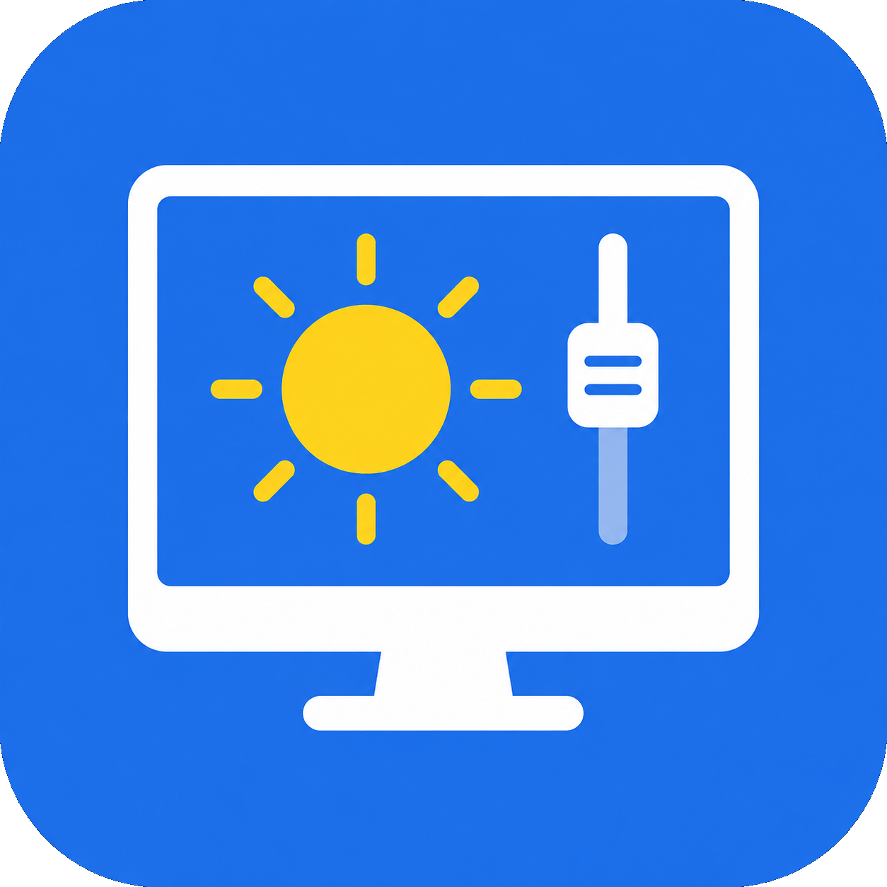

# Brightless

<p align="center">
  
</p>

A modern DDC control application for Linux external monitors.

## Features

- **Brightness, Contrast & Volume Control** — Adjust external monitor settings via DDC/CI
- **Input Source Selection** — Switch between HDMI, DisplayPort, VGA, DVI, and USB-C
- **Power Mode Control** — Turn monitors on, off, or to standby/suspend
- **Automatic Monitor Detection** — Discover DDC-capable displays through libddcutil
- **Mouse Scroll Support** — Scroll over sliders or the tray icon with a configurable 1–10% step; tray changes show the Plasma OSD
- **Dynamic Contrast** — Link brightness and contrast globally or per monitor
- **Settings Persistence** — Save preferences and the previous window size in `~/.config/brightless/settings.json`
- **Optional Autostart** — Launch Brightless on login through XDG autostart; disabled by default
- **Optional System Tray** — Keep Brightless available after closing its window
- **Single Instance** — Launching Brightless again restores the existing window
- **System Language** — Automatically use Chinese, English, French, German, Italian, Japanese, Korean, Polish, Portuguese, Russian, Spanish, or Turkish
- **Qt 6 UI** — Native C++23 backend with QML and Qt Quick Controls

## Requirements

- Linux and DDC/CI-capable external monitors
- Permission to access the system I²C devices
- A C++23 compiler
- CMake 3.21+
- Qt 6.4+ (`DBus`, `LinguistTools`, `Quick`, `QuickControls2`, and `Widgets`)
- KDE Frameworks 6 `GlobalAccel` and `StatusNotifierItem`
- libddcutil 1.2+
- pkg-config

For Debian/Ubuntu:

```bash
sudo apt install cmake g++ pkg-config qt6-base-dev qt6-declarative-dev qt6-tools-dev libkf6globalaccel-dev libkf6statusnotifieritem-dev libddcutil-dev
```

For Fedora:

```bash
sudo dnf install cmake gcc-c++ pkgconf-pkg-config qt6-qtbase-devel qt6-qtdeclarative-devel qt6-qttools-devel kf6-kglobalaccel-devel kf6-kstatusnotifieritem-devel libddcutil-devel
```

For Arch Linux:

```bash
sudo pacman -S cmake gcc pkgconf qt6-declarative qt6-tools kglobalaccel kstatusnotifieritem ddcutil
```

## Build

```bash
cmake -S . -B build -DCMAKE_BUILD_TYPE=Release
cmake --build build --parallel
ctest --test-dir build --output-on-failure
```

## Run

```bash
./build/brightless
```

Install it with:

```bash
cmake --install build --prefix ~/.local
```

### Controls

- **Sliders** — Drag to adjust brightness, contrast, or volume
- **Dropdowns** — Select an input source or power mode
- **Mouse wheel** — Scroll over a slider or the tray icon to change brightness (and contrast when Dynamic Contrast is enabled)
- **Settings** — Use the gear button to configure autostart, tray, global shortcuts, scroll, and dynamic contrast
- **System tray** — Enable “Close to tray icon” in settings, then click the tray icon or choose “Show Brightless” to restore the window

## License

GNU General Public License v3.0 — see [LICENSE](LICENSE).
